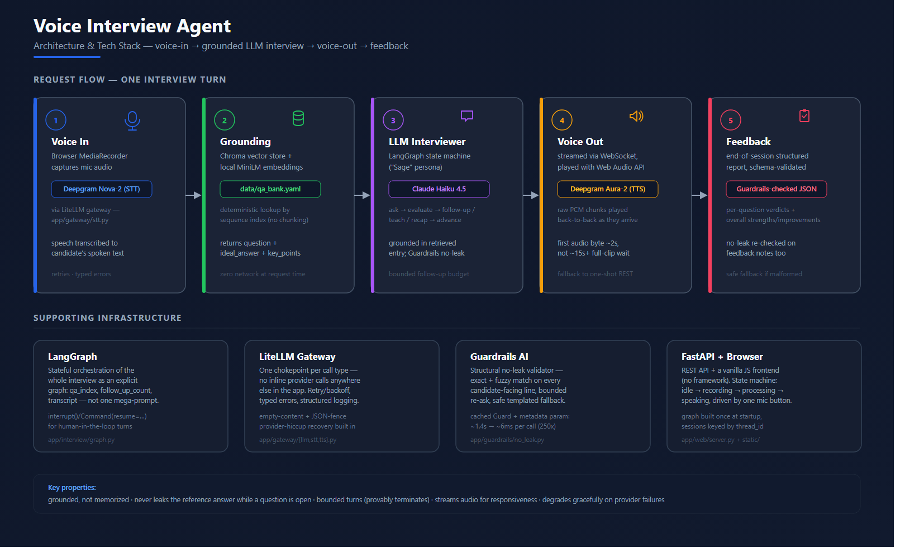

<div align="center">

# 🗣️ Sage — Voice Interview Agent

**A voice-based mock interview agent that listens, grounds itself in a reference Q&A set, and coaches you toward a better answer — without ever handing you the answer key.**


[Architecture Note](ARCHITECTURE_NOTE.md) · [Quick Start](#-quick-start) · [Tech Stack](#-tech-stack) · [How It Works](#-how-it-works)

</div>

---

## Overview

You speak; **Sage** speaks back. It's a working prototype of a voice-driven
interview-practice agent: a candidate talks through a real screening
interview out loud, and the agent listens, asks natural follow-ups,
**teaches** instead of just hinting when an answer is wrong, and produces a
structured feedback report at the end — all grounded in a fixed, editable
reference Q&A set so the grading stays consistent rather than relying on
whatever the LLM happens to "know."

The interview domain (software-engineering screening questions) is just the
content — the engineering point is the **pipeline**: real speech in, a
stateful LLM-driven interview loop that won't leak its own answer key, real
streamed speech out, and a system that degrades gracefully instead of
crashing when a provider hiccups.

> 📺 **Demo video:** _add your recording link here before sharing_

## Architecture



A full written walkthrough of *why* each decision was made — retrieval
design, how the interviewer stays grounded without leaking the answer, and
where every millisecond of latency goes — is in
**[ARCHITECTURE_NOTE.md](ARCHITECTURE_NOTE.md)**.

## How It Works

| # | Stage | What happens |
|---|-------|---------------|
| 1 | **Voice in** | Browser mic → Deepgram Nova-2 (STT), via a LiteLLM gateway. |
| 2 | **Grounding** | The current question's reference answer + key points are retrieved from a local Chroma vector store built over [`data/qa_bank.yaml`](data/qa_bank.yaml) — no chunking, deterministic lookup, zero network cost at request time. |
| 3 | **LLM interviewer ("Sage")** | A LangGraph state machine asks questions, nudges on a weak answer, **actively teaches** the relevant concept on a wrong one, redirects off-topic replies, and recaps what a strong answer would have covered before moving on — all grounded in the retrieved reference via Claude Haiku 4.5 (LiteLLM). |
| 4 | **Voice out** | Replies are synthesized with Deepgram Aura‑2 and **streamed** to the browser over a WebSocket — the browser plays each audio chunk via the Web Audio API the moment it arrives, instead of waiting for the whole clip. |
| 5 | **Feedback** | A structured, schema-validated report (per-question verdicts + overall strengths/improvements) is generated at the end of the session. |

**The hard part — coaching without leaking.** A Guardrails AI validator
structurally blocks the literal reference answer from reaching the
candidate *while a question is still open* (exact + fuzzy match, bounded
re-ask, safe fallback). Once a question closes, Sage is deliberately
allowed to reveal what a strong answer would have covered — exactly like a
real interviewer debriefing before the next question — because the
candidate can't be asked that exact question again this session.

## 🧱 Tech Stack

| Layer | Technology | Role |
|---|---|---|
| Speech-to-text | **Deepgram Nova-2** | Real-time transcription, via LiteLLM |
| Text-to-speech | **Deepgram Aura-2** | Streamed over WebSocket, raw PCM played via Web Audio API |
| Model gateway | **LiteLLM** | Single chokepoint for every LLM/STT call — retries, typed errors, structured logging |
| Interviewer LLM | **Claude Haiku 4.5** (Anthropic) | Fast, cheap, strong JSON-mode instruction-following |
| Orchestration | **LangGraph** | Explicit, stateful interview graph (not one mega-prompt) — bounded turns, human-in-the-loop via `interrupt()` |
| Retrieval | **LangChain + Chroma** | Vector store over the Q&A bank, local `sentence-transformers` embeddings (no hosted embedding API) |
| Safety | **Guardrails AI** | Structural no-answer-leak validator + feedback-schema validation |
| Backend | **FastAPI** | REST API, session management, streaming audio endpoint |
| Frontend | **Vanilla JS + Web Audio API** | No framework — progressive audio playback, live state machine UI |
| Document ingestion | **pypdf** | Extracts text from uploaded PDFs for LLM-drafted Q&A generation |
| Testing | **pytest** | 157 tests, fully mocked — zero real API keys/network calls required to run the suite |

## 🚀 Quick Start

```bash
# 1. Create and activate a virtual environment (don't use system Python)
python -m venv .venv
.venv\Scripts\activate          # Windows
# source .venv/bin/activate     # macOS/Linux

# 2. Install dependencies
pip install -r requirements.txt

# 3. Configure API keys
copy .env.example .env          # Windows
# cp .env.example .env          # macOS/Linux
# then edit .env and fill in OPENROUTER_API_KEY (an Anthropic key — see
# the comment in .env.example for why it's named that) and DEEPGRAM_API_KEY

# 4. Build the retrieval index from the Q&A dataset (one-time; zero API keys needed)
python -m app.retrieval.ingest

# 5. Run the server
python run_server.py
```

Open **http://127.0.0.1:8000/** in a browser, grant microphone access, and
click **Start Interview**.

**Prerequisites:** Python 3.11+, an [Anthropic](https://console.anthropic.com/)
API key (the interviewer LLM) and a [Deepgram](https://deepgram.com/) API
key (covers both STT and TTS). No GPU required — the only local model
download is a ~80MB sentence-embedding model, fetched once.

## ✏️ Updating the Reference Q&A Set

The assignment's core requirement — *update the question bank without
touching code* — has two paths, both live in the browser:

- **Manual CRUD.** Click **Manage questions** → add, edit, or delete a
  single entry directly in the form.
- **Generate from a document.** Upload a `.pdf`, `.md`, or `.txt` file and
  the LLM drafts new Q&A entries grounded in that document's text. Review
  the drafts, deselect anything you don't want, and commit the rest in one
  write.

Both paths write straight to [`data/qa_bank.yaml`](data/qa_bank.yaml),
rebuild the retrieval index automatically, and a new interview session
picks up the change immediately — no restart. Hand-editing the YAML
directly still works too (see the file's own header comment for the
schema), for bulk changes or scripting.

## 🧪 Testing

```bash
pytest -v
```

157 tests, **zero real API keys and zero network calls** — every external
provider call (LLM/STT/TTS) is mocked. Live end-to-end behavior against the
real providers (real transcription, real streamed audio, a real generated
feedback report) has been separately verified by hand.

## 📁 Project Structure

```
app/
  config.py        # env-var settings, read once at import — no hard-coded secrets
  gateway/          # LLM + STT (via LiteLLM) and streaming TTS (direct WebSocket) — the only modules allowed to call a provider
  retrieval/        # Q&A ingest + retrieval store (LangChain + Chroma + local embeddings)
  interview/        # LangGraph interview state machine, persona, feedback generation
  guardrails/       # Guardrails AI: no-answer-leak validator + feedback schema guard
  web/              # FastAPI backend + static browser frontend
data/
  qa_bank.yaml      # the reference Q&A dataset
examples/           # runnable scripts demonstrating each layer in isolation
tests/              # 157 tests, fully mocked, zero real API keys
ARCHITECTURE_NOTE.md  # retrieval design, grounding-vs-leaking, and latency — the engineering writeup
architecture-diagram.svg/.png  # the diagram above, as a standalone vector/raster file
```

## 📐 Engineering Deep Dive

For the reasoning behind the retrieval design, how the interviewer stays
grounded *and* natural without leaking the reference answer, and a measured
breakdown of where the pipeline's latency goes (and how it was reduced) —
see **[ARCHITECTURE_NOTE.md](ARCHITECTURE_NOTE.md)**.
